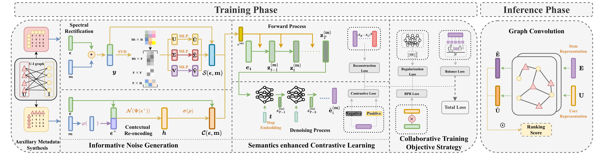

# InfoDCL: Informative Noise Enhanced Diffusion Based Contrastive Learning

Here is the official PyTorch implementation for the paper **"InfoDCL: Informative Noise Enhanced Diffusion Based Contrastive Learning"**, which has been accepted by **KDD '26**.

For more details, please refer to https://dl.acm.org/doi/10.1145/3770854.3780288

This project proposes a novel framework **InfoDCL** to address the critical limitations of **random view construction** and **insufficient semantic information** in sparse recommendation scenarios. InfoDCL employs a diffusion-based process that integrates auxiliary semantics to generate authentic user preference views, and utilizes a collaborative training strategy to transform the interference between generation and preference learning into mutual collaboration.

**Authors**: Xufeng Liang, Zhida Qin, Chong Zhang, Tianyu Huang, and Gangyi Ding.

**Affiliation**: Beijing Institute of Technology, Xi'an Jiaotong University.

## Architecture

The overall architecture of InfoDCL consists of three main parts: **Informative Noise Generation**, **Semantics Enhanced Contrastive Learning**, and **Collaborative Training Objective Strategy**.




## Requirements

The code is implemented using **PyTorch**. The mainly required packages are listed below:

```bash
python>=3.8
torch>=1.8.1
numpy>=1.24.4
scipy>=1.10.1
pandas>=2.0.3
scikit-learn>=1.3.0
```

## Usage

<ol> <li>Data Preparation: Download the datasets from <a href="https://jmcauley.ucsd.edu/data/amazon/">Amazon Review Data</a> and MovieLens, and place them in the <code>dataset/</code> directory.</li>  <li>Training: Run the main script to train and evaluate the model:</li> </ol>

```bash
./office.sh
```

## Implemented Models

<table class="table table-hover table-bordered"> <tr> <th>Model</th>         <th>Paper</th>      <th>Type</th>   <th>Code</th> </tr> <tr> <td scope="row">InfoDCL<td>Fu et al. <a href="https://doi.org/10.1145/3770854.3780288" target="_blank">InfoDCL: Informative Noise Enhanced Diffusion Based Contrastive Learning</a>, KDD '26. </td> <td>CL + Diffusion</td> <td><a href="https://github.com/Qin-lab-code/InfoDCL">PyTorch</a> </td> </tr> </table>

## Related Datasets

We conduct extensive experiments on five real-world datasets. The statistics are summarized below :

| **Datasets** | **ML-1M** | **Office** | **Baby** | **Taobao** | **Electronics** |
| :--- | :--- | :--- | :--- | :--- | :--- |
| **#Users** | 6040 | 4,905 | 19,445 | 12,539 | 32,886 |
| **#Items** | 3706 | 2,420 | 7,050 | 8,735 | 52,974 |
| **#Int.** | 1,000,209 | 53,258 | 159,669 | 83,648 | 337,837 |
| **Sparsity** | 95.53% | 99.55% | 99.88% | 99.92% | 99.69% |

## Reference

If you find this repo helpful to your research, please cite our paper :

```BibTeX
@inproceedings{liang2025Diff,
  title={InfoDCL: Informative Noise Enhanced Diffusion Based Contrastive Learning},
  author={Xufeng Liang, Zhida Qin, Chong Zhang, Tianyu Huang, and Gangyi Ding},
  booktitle={Proceedings of the 32st ACM SIGKDD Conference on Knowledge Discovery and Data Mining},
}

```
